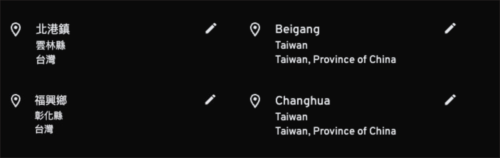

# Immich 反向地理編碼 - 臺灣特化  

[繁體中文](README.md) | [English](README.en.md)

本專案為 Immich 提供專為臺灣使用者設計的反向地理編碼優化，根據使用者習慣提供自然且準確的地理資訊顯示。

目前支援：🇹🇼 **臺灣** | 🇯🇵 **日本** | 🌏 **其他地區中文化**

## 設計理念

本專案以「臺灣使用者體驗」為核心，針對不同地區採用最適合的語言策略：

- **臺灣地區**：使用 NLSC 圖資，解決國家與行政區名稱顯示問題
- **日本地區**：使用国土数値情報ダウンロードサイト資料，保留日文原名（漢字+假名），符合臺灣使用者閱讀習慣
- **其他地區**：提供繁體中文翻譯，確保資訊可讀性（無對照譯名則回退至英文）

> [!WARNING]
> 若整合式部署仍使用 `exec /bin/bash start.sh` 作為 `entrypoint`，Immich 1.142.0 起會在啟動時顯示 `Error: /usr/src/dist/main.js not found` 並陷入重啟循環。
> 請改用 `exec start.sh`（整合式部署章節提供更新後的範例與說明）。

### 使用前後對比
 

## 目錄

- [Immich 反向地理編碼 - 臺灣特化](#immich-反向地理編碼---臺灣特化)
  - [設計理念](#設計理念)
    - [使用前後對比](#使用前後對比)
  - [目錄](#目錄)
  - [支援地區與語言策略](#支援地區與語言策略)
  - [資料來源](#資料來源)
  - [使用方式](#使用方式)
    - [整合式部署（推薦，方便後續更新）](#整合式部署推薦方便後續更新)
    - [手動部署](#手動部署)
  - [指定特定版本](#指定特定版本)
  - [行政區優化策略](#行政區優化策略)
    - [🇹🇼 臺灣地區優化](#-臺灣地區優化)
    - [🇯🇵 日本地區優化](#-日本地區優化)
  - [更新地理資料](#更新地理資料)
    - [整合式部署](#整合式部署)
    - [手動部署](#手動部署-1)
  - [開發者：本地資料處理](#開發者本地資料處理)
    - [1. 安裝依賴](#1-安裝依賴)
    - [2. 提取原始地理資料](#2-提取原始地理資料)
      - [臺灣資料提取](#臺灣資料提取)
      - [日本資料提取](#日本資料提取)
    - [3. 完整資料處理流程](#3-完整資料處理流程)
      - [註冊 LocationIQ API](#註冊-locationiq-api)
      - [執行資料處理](#執行資料處理)
  - [致謝](#致謝)
  - [授權條款](#授權條款)
  
## 支援地區與語言策略

本專案根據臺灣使用者的閱讀習慣，對不同地區採用最合適的語言處理策略：

| 地區 | 語言策略 | 資料來源 | 說明 |
|------|----------|----------|------|
| 🇹🇼 臺灣 | 繁體中文（官方名稱） | NLSC 國土測繪中心 | 優化地理資料；解決國家與行政區顯示名稱錯誤的問題 |
| 🇯🇵 日本 | 日文原名（漢字+假名） | 国土数値情報ダウンロードサイト | 優化地理資料；以日文原名顯示 |
| 🌏 其他 | 繁體中文翻譯 | 自訂翻譯 → GeoNames 翻譯 → GeoNames 英文 | 優先使用臺灣慣用譯名，若無則使用 GeoNames 資料 |

> **為什麼日本保留日文？**
> 臺灣使用者普遍熟悉日文漢字與假名的組合，「横浜市」與「橫濱市」相比不容易造成辨識困難，「うるま市」亦不會影響普遍臺灣用戶的理解。

## 資料來源

本專案使用的地理數據主要來自以下來源：

1.  **GeoNames** ([geonames.org](https://www.geonames.org/)): 作為全球地理位置的基礎數據庫。
2.  **中華民國國土測繪中心 (NLSC)**:
    - 來源: [國土測繪中心開放資料平台](https://whgis-nlsc.moi.gov.tw/Opendata/Files.aspx)
    - 資料集: 村(里)界 (TWD97經緯度), 版本 1140620
    - 用途: 作為臺灣地區村里界線及行政區名稱的主要數據源，確保資料的準確性與權威性。
3.  **国土数値情報ダウンロードサイト**:
    - 來源：[国土数値情報ダウンロードサービス](https://nlftp.mlit.go.jp/ksj/)
    - 資料集：行政区域データ（世界測地系）
    - 用途：作為日本地區行政區邊界與名稱的主要數據源
4.  **LocationIQ**: 用於處理非臺灣、非日本地區的反向地理編碼請求，校準行政區劃層級與翻譯。
5.  **中華民國經濟部國際貿易署 & 中華民國外交部**: 作為部分國家/地區中文譯名的參考來源。

> [!NOTE]
> 由於 Immich 的反向地理解析功能基於其載入的資料庫，並採用最近距離原則匹配地名，部分結果可能無法完全精確，或與預期不同。例如：
> - 邊界附近的座標可能被判定為鄰近的行政區
> - 某些小型島嶼或特殊地理位置可能無法精確對應

## 使用方式

本專案支援以下兩種部署方式：  

1. 整合式部署（適用於 Immich 的 docker-compose 部署，可確保容器啟動時自動載入最新的臺灣特化資料）。

2. 手動部署（適用於自訂部署環境，可手動下載並配置特化資料）。

### 整合式部署（推薦，方便後續更新）

1. **修改 `docker-compose.yml` 配置**  
   在 `immich_server` 服務內新增 `entrypoint` 設定，使容器啟動時自動下載最新地理資料：  
   ```yaml  
   services:
     immich_server:
      container_name: immich_server

      # 其他配置省略

      entrypoint: [ "tini", "--", "/bin/bash", "-c", "bash <(curl -sSL https://raw.githubusercontent.com/RxChi1d/immich-geodata-zh-tw/refs/heads/main/update_data.sh) --install && exec start.sh" ]
   ```  
   > [!NOTE]
   > - `entrypoint` 會在容器啟動時先執行本專案的 `update_data.sh` 腳本，自動下載並配置臺灣特化資料，隨後執行 Immich 伺服器的 `start.sh` 啟動服務。
   > - 整合式部署也支援指定特定版本下載，詳情請參考 [指定特定版本](#指定特定版本) 章節。

2. **重啟 Immich**  
   執行以下命令以重啟 Immich： 
   ```bash  
   # 如果使用 docker-compose 部署
   docker compose down && docker compose up
   ```  
   - 啟動後，檢查日誌中是否顯示 `10000 geodata records imported` 等類似訊息，確認 geodata 已成功更新。  
   - 若未更新，請修改 `geodata/geodata-date.txt` 為一個更新的時間戳，確保其晚於 Immich 上次加載的時間。 
  
3. **重新提取照片元數據**  
   登錄 Immich 管理後台，前往 **系統管理 > 任務**，點擊 **提取元數據 > 全部**，以觸發照片元數據的重新提取。完成後，所有照片的地理資訊將顯示為中文。  
   新上傳的照片無需額外操作，即可直接支援中文搜尋。  

### 手動部署

1. **修改 `docker-compose.yml` 配置**  
   在 `volumes` 內新增以下映射（請依據實際環境調整路徑）：  
   ```yaml
   volumes:
     - /mnt/user/appdata/immich/geodata:/build/geodata:ro
     - /mnt/user/appdata/immich/i18n-iso-countries/langs:/usr/src/app/server/node_modules/i18n-iso-countries/langs:ro
   ```
   > [!NOTE]
   > 若使用 Immich < 1.136.0 版本，請將第二行改為：  
   > `/mnt/user/appdata/immich/i18n-iso-countries/langs:/usr/src/app/node_modules/i18n-iso-countries/langs:ro`
  
2. **下載臺灣特化資料**  
   提供以下兩種下載方式：  
       
   (1) **自動下載**  
      參考本專案中的 `update_data.sh` 腳本，修改 `DOWNLOAD_DIR` 為存放 geodata 和 i18n-iso-countries 的資料夾路徑，並執行腳本：  
      ```bash
      bash update_data.sh
      ```  
      > [!NOTE] 
      > - 手動部署也支援指定特定版本下載，詳情請參考 [指定特定版本](#指定特定版本) 章節。
      > - UnRAID 使用者可以通過 User Scripts 插件執行腳本。
     
   (2) **手動下載**  
      前往 [Release 頁面](https://github.com/RxChi1d/immich-geodata-zh-tw/releases) 查找所需的版本，下載對應的 `release.tar.gz` 或 `release.zip`，並將其解壓縮至指定位置。
  
3. **重啟 Immich 和重新提取照片元數據**  
   與[**整合式部署**](#整合式部署)的步驟 2、3 相同。

## 指定特定版本

在某些情況下（例如最新的 release 出現問題），你可能需要下載或回滾到特定的 release 版本。本專案的更新腳本支援透過 `--tag` 參數來指定要下載的 release tag。

**如何找到可用的 Tag？**
請前往本專案的 [Releases 頁面](https://github.com/RxChi1d/immich-geodata-zh-tw/releases) 查看所有可用的 release tag 名稱（例如  `v1.0.0`, `nightly` 等）。

**使用範例：**

1.  **整合式部署 (`docker-compose.yml` 中的 `entrypoint`)**
    在 `entrypoint` 的指令後面加上 `--tag <tag_name>`：
    ```yaml
    entrypoint: [ "tini", "--", "/bin/bash", "-c", "bash <(curl -sSL https://raw.githubusercontent.com/RxChi1d/immich-geodata-zh-tw/refs/heads/main/update_data.sh) --install --tag <tag_name> && exec start.sh" ] 
    ```
    將 `<tag_name>` 替換為你想要下載的具體 tag 名稱。如果省略 `--tag`，則預設下載最新的 release (`latest`)。

2.  **手動部署 (`update_data.sh`)**
    執行腳本時加上 `--tag <tag_name>`：
    ```bash
    bash update_data.sh --tag <tag_name>
    ```
    將 `<tag_name>` 替換為你想要下載的具體 tag 名稱。如果省略 `--tag`，則預設下載最新的 release (`latest`)。

> [!NOTE]
> 腳本會先驗證指定的 tag 是否存在於 GitHub Releases，如果 tag 無效則會提示錯誤並終止執行，因此請在執行前確保 tag 有效。
  
## 行政區優化策略

### 🇹🇼 臺灣地區優化

- **官方圖資為核心**：使用 NLSC 村(里)界圖資，確保資料權威性
- **優化國家與行政區名稱**：解決 Immich 原生資料中「臺灣」顯示為「中國臺灣省」且缺失多數縣市名稱的問題
- **行政區層級優化**：Admin1=直轄市/省轄縣市、Admin2=鄉鎮市區

> 📖 詳細的臺灣資料處理邏輯請參閱 [臺灣行政區處理文檔](docs/zh-tw/taiwan-admin-processing.md)

### 🇯🇵 日本地區優化

- **保留日文原名**：維持漢字+假名組合（如「静岡県」而非「靜岡縣」）
- **行政區細分處理**：普通市、特別區、政令指定都市、東京都特別區部等均有適當處理
- **郡轄町村智慧處理**：自動判斷是否需要郡名前綴，避免同名衝突

> 📖 詳細的日本行政區處理邏輯請參閱 [日本行政區處理文檔](docs/zh-tw/japan-admin-processing.md)

## 更新地理資料

### 整合式部署
  
只需重新啟動 Immich 容器，即可自動更新地理資料。  

### 手動部署
  
1. 下載最新 release.zip，並解壓至指定位置。

2. 重新提取照片元數據（與「使用方式-[手動部署](#手動部署)」相同）。

## 開發者：本地資料處理

### 1. 安裝依賴

首先安裝 uv（如果尚未安裝）：

請參考 [uv 官方安裝指南](https://docs.astral.sh/uv/getting-started/installation/) 根據你的作業系統安裝 uv。

然後安裝專案依賴：

```bash
uv sync
```

### 2. 提取原始地理資料

如果你需要處理新的國家或更新現有的地理資料來源，可以使用 `extract` 命令從 Shapefile 提取資料。此步驟是選用的，僅在需要更新資料來源時執行。

#### 臺灣資料提取

資料來源：[國土測繪中心（NLSC）](https://whgis-nlsc.moi.gov.tw/Opendata/Files.aspx)

```bash
# 1. 下載「村(里)界（TWD97經緯度）」資料並解壓縮
# 2. 執行提取命令
uv run python main.py extract --country TW \
  --shapefile geoname_data/VILLAGE_NLSC_1140825/VILLAGE_NLSC_1140825.shp \
  --output meta_data/tw_geodata.csv
```

#### 日本資料提取

資料來源：[国土数値情報](https://nlftp.mlit.go.jp/ksj/gml/datalist/KsjTmplt-N03-2025.html)

```bash
# 1. 下載「行政区域データ（世界測地系）」並解壓縮
# 2. 執行提取命令
uv run python main.py extract --country JP \
  --shapefile geoname_data/N03-20250101_GML/N03-20250101.shp \
  --output meta_data/jp_geodata.csv
```

提取完成後，執行 `main.py release` 時會自動整合這些資料。

### 3. 完整資料處理流程

完成資料提取（或使用現有的資料）後，可以執行完整的資料處理流程來生成 release。

#### 註冊 LocationIQ API

至 [LocationIQ](https://locationiq.com/) 註冊帳號，並取得 API Key。

#### 執行資料處理

```bash
uv run python main.py release --locationiq-api-key "YOUR_API_KEY" --country-code "KR" "TH"
```

> [!NOTE]
> - 可以通過 `uv run python main.py --help` 或 `uv run python main.py release --help` 查看更多選項。
> - `--country-code` 參數可指定需要處理的國家代碼，多個代碼之間使用空格分隔。(目前僅測試過 "KR" "TH")

> [!WARNING]
> - 由於 LocationIQ 的 API 有請求次數限制 (可登入後於後台查看)，因此請注意要處理的國家的地名數量，以免超出限制。
> - 本專案允許 LocationIQ 反向地理編碼查詢的進度恢復，若超過當日請求限制，可於更換 api 金鑰或次日繼續執行。
>   - 需加上 `--pass-cleanup`參數，以取消重設資料夾功能： `uv run python main.py release --locationiq-api-key "YOUR_API_KEY" --country-code "KR" "TH" --pass-cleanup`。

## 致謝  
  
本專案基於 [immich-geodata-cn](https://github.com/ZingLix/immich-geodata-cn) 修改，特別感謝原作者 [ZingLix](https://github.com/ZingLix) 的貢獻。  
  
## 授權條款  
  
本專案採用 GPL 授權。
