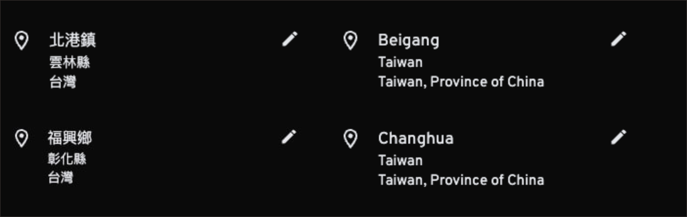

# Immich 反向地理編碼 - 臺灣特化  

> [!IMPORTANT]
> - 升級提醒：v3.0.0 新增泰國圖資（繁體中文在地化）。若您已部署本專案且媒體庫含有泰國地區照片，請在更新至 v3.0.0 後執行「[重新擷取照片中繼資料](#整合式部署推薦方便後續更新)」，以套用最新的泰國資料。

[繁體中文](README.md) | [English](README.en.md)

本專案為 Immich 提供專為臺灣使用者設計的反向地理編碼優化，根據使用者習慣提供自然且準確的地理資訊顯示。

目前支援：🇹🇼 **臺灣** | 🇯🇵 **日本** | 🇰🇷 **南韓** | 🇹🇭 **泰國** | 🇮🇩 **印尼** | 🌏 **其他地區中文化**

## 設計理念

本專案以「臺灣使用者體驗」為核心，針對不同地區採用最適合的語言策略：

- **臺灣地區**：使用 NLSC 圖資，解決國家與行政區名稱顯示問題
- **日本地區**：使用国土数値情報ダウンロードサイト資料，保留日文原名（漢字+假名），符合臺灣使用者閱讀習慣
- **南韓地區**：使用 admdongkor 專案資料，提供繁體中文翻譯，符合臺灣使用者閱讀習慣
- **泰國地區**：使用 COD-AB 官方邊界資料，提供 Admin1/Admin2 繁中翻譯，並以官方英文與泰文作為 fallback
- **印尼地區**：使用 BIG（印尼地理空間資訊局）官方村級圖資，提供 Admin1/Admin2 繁中翻譯，缺中文標籤時回退 BIG 官方印尼文
- **其他地區**：優先採用國家教育研究院《外國地名譯名》的官方臺灣譯名補洞與升級，其次使用 GeoNames 翻譯，確保資訊可讀性（無對照譯名則回退至英文）

### 使用前後對比
 

## 目錄

- [Immich 反向地理編碼 - 臺灣特化](#immich-反向地理編碼---臺灣特化)
  - [設計理念](#設計理念)
    - [使用前後對比](#使用前後對比)
  - [目錄](#目錄)
  - [支援地區與語言策略](#支援地區與語言策略)
  - [資料來源](#資料來源)
  - [使用方式](#使用方式)
    - [整合式部署（推薦，方便後續更新）](#整合式部署推薦方便後續更新)
    - [手動部署](#手動部署)
  - [指定特定版本](#指定特定版本)
  - [行政區優化策略](#行政區優化策略)
    - [🇹🇼 臺灣地區優化](#-臺灣地區優化)
    - [🇯🇵 日本地區優化](#-日本地區優化)
    - [🇰🇷 南韓地區優化](#-南韓地區優化)
    - [🇹🇭 泰國地區優化](#-泰國地區優化)
    - [🇮🇩 印尼地區優化](#-印尼地區優化)
  - [更新地理資料](#更新地理資料)
    - [整合式部署](#整合式部署)
    - [手動部署](#手動部署-1)
  - [開發者：本地資料處理](#開發者本地資料處理)
    - [1. 安裝依賴](#1-安裝依賴)
    - [官方預編譯 Binary](#官方預編譯-binary)
    - [本地編譯 Rust CLI](#本地編譯-rust-cli)
    - [2. 提取原始地理資料](#2-提取原始地理資料)
      - [臺灣資料提取](#臺灣資料提取)
      - [日本資料提取](#日本資料提取)
      - [南韓資料提取](#南韓資料提取)
      - [泰國資料提取](#泰國資料提取)
      - [印尼資料提取](#印尼資料提取)
    - [3. 完整資料處理流程](#3-完整資料處理流程)
      - [註冊 LocationIQ API](#註冊-locationiq-api)
      - [執行資料處理](#執行資料處理)
    - [4. Rust 驗證](#4-rust-驗證)
  - [致謝](#致謝)
  - [授權條款](#授權條款)
  
## 支援地區與語言策略

本專案根據臺灣使用者的閱讀習慣，對不同地區採用最合適的語言處理策略：

| 地區 | 語言策略 | 資料來源 | 說明 |
|------|----------|----------|------|
| 🇹🇼 臺灣 | 繁體中文（官方名稱） | NLSC 國土測繪中心 | 優化地理資料；解決國家與行政區顯示名稱錯誤的問題 |
| 🇯🇵 日本 | 日文原名（漢字+假名） | 国土数値情報ダウンロードサイト | 優化地理資料；以日文原名顯示 |
| 🇰🇷 南韓 | 繁體中文翻譯 | admdongkor（官方行政區邊界） | 優化地理資料；提供繁體中文翻譯 |
| 🇹🇭 泰國 | 繁體中文翻譯（官方英文 / 泰文 fallback） | COD-AB Thailand | 優化地理資料；以官方行政區邊界計算行政區中心點 |
| 🇮🇩 印尼 | 繁體中文翻譯（BIG 官方印尼文 fallback） | BIG（Badan Informasi Geospasial） | 優化地理資料；以村級邊界計算行政區中心點，涵蓋 38 省 |
| 🌏 其他 | 繁體中文翻譯 | 國教院官方譯名 → GeoNames 翻譯 → GeoNames 英文 | 優先使用國教院官方臺灣譯名，若無則使用 GeoNames 資料 |

> **為什麼日本保留日文？**
> 臺灣使用者普遍熟悉日文漢字與假名的組合，「横浜市」與「橫濱市」相比不容易造成辨識困難，「うるま市」亦不會影響普遍臺灣用戶的理解。

## 資料來源

本專案使用的地理數據主要來自以下來源：

1.  **GeoNames** ([geonames.org](https://www.geonames.org/))
    - **授權**: Creative Commons Attribution 4.0 International (CC-BY 4.0)
    - **用途**: 作為全球地理位置的基礎數據庫
2.  **OpenStreetMap** (透過 LocationIQ)
    - **授權**: Open Database License (ODbL) 1.0
    - **用途**: 透過 LocationIQ API 取得臺灣、日本、南韓、泰國、印尼以外地區的反向地理編碼資料
    - **聲明**: Data © OpenStreetMap contributors, ODbL 1.0
3.  **中華民國國土測繪中心 (NLSC)**
    - **來源**: [國土測繪中心開放資料平台](https://whgis-nlsc.moi.gov.tw/Opendata/Files.aspx)
    - **資料集**: 村(里)界 (TWD97經緯度), 版本 1140620
    - **授權**: 政府資料開放授權條款-第1版
    - **用途**: 作為臺灣地區村里界線及行政區名稱的主要數據源，確保資料的準確性與權威性
4.  **国土数値情報ダウンロードサイト**
    - **來源**: [国土数値情報ダウンロードサービス](https://nlftp.mlit.go.jp/ksj/)
    - **資料集**: 行政区域データ（世界測地系）
    - **授權**: 日本政府公開資料
    - **用途**: 作為日本地區行政區邊界與名稱的主要數據源
5.  **admdongkor**
    - **來源**: [admdongkor](https://github.com/vuski/admdongkor)
    - **資料集**: 南韓官方行政區邊界資料（GeoJSON 格式）
    - **授權**: 無額外限制（作者建議標示出處，詳見 [NOTICE.md](NOTICE.md)）
    - **用途**: 作為南韓地區行政區邊界與名稱的主要數據源
6.  **Thailand COD-AB**
    - **來源**: [HDX Thailand Subnational Administrative Boundaries](https://data.humdata.org/dataset/cod-ab-tha)
    - **資料集**: Thailand administrative level 0-3 boundaries (COD-AB)
    - **授權**: Creative Commons Attribution for Intergovernmental Organisations (CC BY-IGO)
    - **用途**: 作為泰國地區行政區邊界與名稱的主要數據源
7.  **印尼地理空間資訊局（BIG，Badan Informasi Geospasial）**
    - **來源**: BIG 官方 ArcGIS REST FeatureServer（desa 村級圖徵服務）
    - **資料集**: 印尼行政區 desa（村級）邊界，版本 TASWIL20230928，含 38 省全量資料
    - **授權**: 印尼官方公開地理資料（本專案僅作衍生加工輸入，不散布原始向量圖資）
    - **用途**: 作為印尼地區行政區邊界與名稱的主要數據源
8.  **國家教育研究院《外國地名譯名》**
    - **來源**: [政府資料開放平臺 dataset 15211](https://data.gov.tw/dataset/15211)
    - **授權**: 政府資料開放授權條款-第1版
    - **用途**: 全球非 handler 地區的官方臺灣譯名補洞與覆寫
9.  **其他參考資料**
    - **中華民國經濟部國際貿易署 & 中華民國外交部**: 作為部分國家/地區中文譯名的參考來源

> [!NOTE]
> 完整的資料來源聲明與授權資訊請參閱 [NOTICE.md](NOTICE.md)。

> [!NOTE]
> 由於 Immich 的反向地理解析功能基於其載入的資料庫，並採用最近距離原則匹配地名，部分結果可能無法完全精確，或與預期不同。例如：
> - 邊界附近的座標可能被判定為鄰近的行政區
> - 某些小型島嶼或特殊地理位置可能無法精確對應

## 使用方式

本專案支援以下兩種部署方式：  

1. 整合式部署（適用於 Immich 的 docker-compose 部署，可確保容器啟動時自動載入最新的臺灣特化資料）。

2. 手動部署（適用於自訂部署環境，可手動下載並配置特化資料）。

### 整合式部署（推薦，方便後續更新）

1. **修改 `docker-compose.yml` 配置**  
   在 `immich_server` 服務內新增 `entrypoint` 設定，使容器啟動時自動下載最新地理資料：  
   ```yaml  
   services:
     immich_server:
      container_name: immich_server

      # 其他配置省略

      entrypoint: [ "tini", "--", "/bin/bash", "-c", "bash <(curl -sSL https://github.com/RxChi1d/immich-geodata-zh-tw/releases/latest/download/update_data.sh) --install && exec start.sh" ]
   ```  
   > [!NOTE]
   > - `entrypoint` 會在容器啟動時先執行本專案的 `update_data.sh` 腳本，自動下載並配置臺灣特化資料，隨後執行 Immich 伺服器的 `start.sh` 啟動服務。
   > - 整合式部署也支援指定特定版本下載，詳情請參考 [指定特定版本](#指定特定版本) 章節。

2. **重啟 Immich**  
   執行以下命令以重啟 Immich： 
   ```bash  
   # 如果使用 docker-compose 部署
   docker compose down && docker compose up
   ```  
   - 啟動後，檢查日誌中是否顯示 `10000 geodata records imported` 等類似訊息，確認 geodata 已成功更新。  
   - 若未更新，請修改 `geodata/geodata-date.txt` 為一個更新的時間戳，確保其晚於 Immich 上次加載的時間。 
  
3. **重新提取照片元數據**  
   登錄 Immich 管理後台，前往 **系統管理 > 任務**，點擊 **提取元數據 > 全部**，以觸發照片元數據的重新提取。完成後，所有照片的地理資訊將顯示為中文。  
   新上傳的照片無需額外操作，即可直接支援中文搜尋。  

### 手動部署

1. **修改 `docker-compose.yml` 配置**  
   在 `volumes` 內新增以下映射（請依據實際環境調整路徑）：  
   ```yaml
   volumes:
     - /mnt/user/appdata/immich/geodata:/build/geodata:ro
     - /mnt/user/appdata/immich/i18n-iso-countries/langs:/usr/src/app/server/node_modules/i18n-iso-countries/langs:ro
   ```
   > [!NOTE]
   > 若使用 Immich < 1.136.0 版本，請將第二行改為：  
   > `/mnt/user/appdata/immich/i18n-iso-countries/langs:/usr/src/app/node_modules/i18n-iso-countries/langs:ro`
  
2. **下載臺灣特化資料**  
   提供以下兩種下載方式：  
       
   (1) **自動下載**  
      參考本專案中的 `update_data.sh` 腳本，修改 `DOWNLOAD_DIR` 為存放 geodata 和 i18n-iso-countries 的資料夾路徑，並執行腳本：  
      ```bash
      bash update_data.sh
      ```  
      > [!NOTE] 
      > - 手動部署也支援指定特定版本下載，詳情請參考 [指定特定版本](#指定特定版本) 章節。
      > - UnRAID 使用者可以通過 User Scripts 插件執行腳本。
     
   (2) **手動下載**  
      前往 [Release 頁面](https://github.com/RxChi1d/immich-geodata-zh-tw/releases) 查找所需的版本，下載對應的 `release.tar.gz` 或 `release.zip`，並將其解壓縮至指定位置。
  
3. **重啟 Immich 和重新提取照片元數據**  
   與[**整合式部署**](#整合式部署)的步驟 2、3 相同。

## 指定特定版本

在某些情況下（例如最新的 release 出現問題），你可能需要下載或回滾到特定的 release 版本。本專案的更新腳本支援透過 `--tag` 參數來指定要下載的 release tag。

**如何找到可用的 Tag？**
請前往本專案的 [Releases 頁面](https://github.com/RxChi1d/immich-geodata-zh-tw/releases) 查看所有可用的 release tag 名稱（例如  `v2.2.4`, `nightly` 等）。

**使用範例：**

1.  **整合式部署 (`docker-compose.yml` 中的 `entrypoint`)**
    在 `entrypoint` 的指令後面加上 `--tag <tag_name>`：
    ```yaml
    entrypoint: [ "tini", "--", "/bin/bash", "-c", "bash <(curl -sSL https://github.com/RxChi1d/immich-geodata-zh-tw/releases/download/<tag_name>/update_data.sh) --install --tag <tag_name> && exec start.sh" ] 
    ```
    將 `<tag_name>` 分別替換為你想要下載的具體 tag 名稱。如果省略 `--tag`，則預設下載最新的 release (`latest`)。

2.  **手動部署 (`update_data.sh`)**
    執行腳本時加上 `--tag <tag_name>`：
    ```bash
    bash update_data.sh --tag <tag_name>
    ```
    將 `<tag_name>` 替換為你想要下載的具體 tag 名稱。如果省略 `--tag`，則預設下載最新的 release (`latest`)。

> [!NOTE]
> 腳本會先驗證指定的 tag 是否存在於 GitHub Releases，如果 tag 無效則會提示錯誤並終止執行，因此請在執行前確保 tag 有效。
  
## 行政區優化策略

### 🇹🇼 臺灣地區優化

- **官方圖資為核心**：使用 NLSC 村(里)界圖資，確保資料權威性
- **優化國家與行政區名稱**：解決 Immich 原生資料中「臺灣」顯示為「中國臺灣省」且缺失多數縣市名稱的問題
- **行政區層級優化**：優化 Admin1（直轄市/省轄縣市）與 cities500（地名資料）

> 📖 詳細的臺灣資料處理邏輯請參閱 [臺灣行政區處理文檔](docs/zh-tw/taiwan-admin-processing.md)

### 🇯🇵 日本地區優化

- **保留日文原名**：維持漢字+假名組合（如「静岡県」而非「靜岡縣」）
- **行政區細分處理**：普通市、特別區、政令指定都市、東京都特別區部等均有適當處理
- **郡轄町村智慧處理**：自動判斷是否需要郡名前綴，避免同名衝突

> 📖 詳細的日本行政區處理邏輯請參閱 [日本行政區處理文檔](docs/zh-tw/japan-admin-processing.md)

### 🇰🇷 南韓地區優化

- **繁體中文翻譯**：從 admdongkor 專案提取官方行政區邊界並自動翻譯為繁體中文
- **行政區命名優化**：廣域市統一加「市」字（首爾市、釜山市、大邱市等）
- **特殊行政區處理**：濟州道與濟州市區分、世宗市採用業界通用譯名
- **行政層級處理**：自動拆分「市＋區/郡」結構，支援特殊行政結構

### 🇹🇭 泰國地區優化

- **官方邊界資料**：使用 COD-AB `tha_admin3` sub-district / tambon 邊界資料
- **繁體中文翻譯**：Admin1/Admin2 使用 Wikidata translator，缺少中文結果時回退 COD-AB 官方英文與官方泰文
- **最近距離最佳化**：使用 Thailand Albers 投影計算幾何中心點，提升 Immich 最近點反向地理解析命中率
- **座標策略驗證**：不使用 COD-AB 內建 `center_lat` / `center_lon` 作為預設，因其較接近官方代表點而非最近點模型下的最佳單點

> 📖 詳細的泰國行政區處理邏輯請參閱 [泰國行政區處理文檔](docs/zh-tw/thailand-admin-processing.md)

### 🇮🇩 印尼地區優化

- **官方村級圖資**：使用 BIG（Badan Informasi Geospasial，印尼地理空間資訊局）官方 ArcGIS REST 服務發布的 desa（村級）邊界資料（版本 TASWIL20230928，含 38 省全量 83,461 筆可用 feature）
- **繁體中文翻譯**：Admin1（省）與 Admin2（縣／市）使用 Wikidata translator 並以 P131 行政隸屬逐級驗證；缺少可靠中文標籤時回退 BIG 官方印尼文原文，Admin3（郡）/ Admin4（村）則保留印尼文原文
- **三時區解析**：依 38 省 per-province 對照表解析印尼三時區（WIB `Asia/Jakarta`、WITA `Asia/Makassar`、WIT `Asia/Jayapura`）
- **最近距離最佳化**：使用印尼 Albers 等積投影（`+lat_1=1 +lat_2=-8 +lon_0=118`）計算幾何中心點；multipart polygon 每個 part 各出一列，提升群島地形的最近鄰命中率（admin2 命中率 96.99%）

> 📖 詳細的印尼行政區處理邏輯請參閱 [印尼行政區處理文檔](docs/zh-tw/indonesia-admin-processing.md)

## 更新地理資料

### 整合式部署
  
只需重新啟動 Immich 容器，即可自動更新地理資料。  

### 手動部署
  
1. 下載最新 release.zip，並解壓至指定位置。

2. 重新提取照片元數據（與「使用方式-[手動部署](#手動部署)」相同）。

## 開發者：本地資料處理

### 1. 安裝依賴

本機 production 資料處理預設使用 Rust CLI。請先安裝 Rust toolchain，並確認系統可使用
`unzip`、`pkg-config` 與 PROJ development library（例如 Ubuntu 的 `libproj-dev`）。

#### 官方預編譯 Binary

GitHub Releases 目前只提供 Linux x86_64 的預編譯 Rust CLI binary，主要供
GitHub Actions、Linux server 與 Immich container 類環境使用。macOS 與 Windows
目前請使用本地編譯方式。

#### 本地編譯 Rust CLI

如需在非 Linux 環境或自訂 Linux 環境執行資料處理，請先安裝 Rust toolchain 與
PROJ development library，再執行：

```bash
cargo build --release
```

編譯完成後，binary 會位於：

```bash
target/release/immich-geodata
```

也可以直接用 `cargo run` 執行：

```bash
cargo run --release -- help
```

### 2. 提取原始地理資料

如果你需要處理新的國家或更新現有的地理資料來源，可以使用 `extract` 命令從 Shapefile 或 GeoJSON 提取資料。此步驟是選用的，僅在需要更新資料來源時執行。

#### 臺灣資料提取

資料來源：[國土測繪中心（NLSC）](https://whgis-nlsc.moi.gov.tw/Opendata/Files.aspx)

```bash
# 1. 下載「村(里)界（TWD97經緯度）」資料並解壓縮
# 2. 執行提取命令
cargo run --release -- extract --country TW \
  --shapefile geoname_data/VILLAGE_NLSC_1140825/VILLAGE_NLSC_1140825.shp \
  --output meta_data/tw_geodata.csv
```

#### 日本資料提取

資料來源：[国土数値情報](https://nlftp.mlit.go.jp/ksj/gml/datalist/KsjTmplt-N03-2025.html)

```bash
# 1. 下載「行政区域データ（世界測地系）」並解壓縮
# 2. 執行提取命令
cargo run --release -- extract --country JP \
  --shapefile geoname_data/N03-20250101_GML/N03-20250101.shp \
  --output meta_data/jp_geodata.csv
```

#### 南韓資料提取

資料來源：[admdongkor](https://github.com/vuski/admdongkor)

```bash
# 1. 從 admdongkor 專案下載官方行政區邊界資料並解壓縮
# 2. 執行提取命令
cargo run --release -- extract --country KR \
  --shapefile geoname_data/HangJeongDong_verYYYYMMDD.geojson \
  --output meta_data/kr_geodata.csv
```

#### 泰國資料提取

資料來源：[Thailand COD-AB](https://data.humdata.org/dataset/cod-ab-tha)

```bash
# 1. 下載 tha_admin_boundaries.shp.zip 並解壓縮
# 2. 使用 tha_admin3.shp 提取 Admin 3 / Tambon 邊界資料
cargo run --release -- extract --country TH \
  --shapefile geoname_data/tha_admin_boundaries/tha_admin3.shp \
  --output meta_data/th_geodata.csv
```

泰國提取會讀取或建立 `geoname_data/TH_wikidata_cache.json`，用於 Admin1/Admin2 繁中翻譯；Admin3 目前保留 COD-AB 官方英文。

提取完成後，執行 Rust `release` 時會自動整合這些資料。

#### 印尼資料提取

資料來源：BIG（Badan Informasi Geospasial）官方 ArcGIS REST FeatureServer

```bash
# 1. 從 BIG 官方 REST 服務以分頁方式下載 desa 村級圖資（geometryPrecision=6，版本 TASWIL20230928）
#    下載方式與固定參數請參閱 docs/research/indonesia-handler.md
# 2. 執行提取命令
cargo run --release -- extract --country ID \
  --shapefile <path_to_BIG_desa_geojson> \
  --output meta_data/id_geodata.csv
```

印尼提取會讀取或建立 `geoname_data/ID_wikidata_cache.json`，用於 Admin1（省）/ Admin2（縣市）繁中翻譯；Admin3（郡）/ Admin4（村）保留 BIG 官方印尼文。詳細下載流程與固定參數請參閱 [印尼 handler 研究文件](docs/research/indonesia-handler.md)。

提取完成後，執行 Rust `release` 時會自動整合這些資料。

### 3. 完整資料處理流程

完成資料提取（或使用現有的資料）後，可以執行完整的資料處理流程來生成 release。

#### 註冊 LocationIQ API

至 [LocationIQ](https://locationiq.com/) 註冊帳號，並取得 API Key。

#### 執行資料處理

```bash
cargo run --release -- release \
  --locationiq-api-key "YOUR_API_KEY" \
  --country-code "US"
```

> [!NOTE]
> - 可以通過 `cargo run -- help` 查看更多選項。
> - `--country-code` 參數可指定需要處理的國家代碼，多個代碼之間使用空格分隔。
> - 臺、日、韓、泰、印（TW/JP/KR/TH/ID）已改由官方圖資 handler 產生，無需也不應以 LocationIQ 處理；此流程僅用於為其他國家產生 metadata。

> [!WARNING]
> - 由於 LocationIQ 的 API 有請求次數限制 (可登入後於後台查看)，因此請注意要處理的國家的地名數量，以免超出限制。
> - 本專案允許 LocationIQ 反向地理編碼查詢的進度恢復，若超過當日請求限制，可於更換 api 金鑰或次日繼續執行。
>   - 需加上 `--pass-cleanup` 參數，以取消重設資料夾功能： `cargo run --release -- release --locationiq-api-key "YOUR_API_KEY" --country-code "US" --pass-cleanup`。

### 4. Rust 驗證

Rust CLI 提供 dry-run contract，可在不呼叫外部 API 或下載網路的情況下驗證
release orchestration：

```bash
cargo run -- release \
  --dry-run \
  --locationiq-api-key "fixture" \
  --country-code "KR" "TH" \
  --batch-size 100 \
  --locationiq-qps 2
```

需要驗證 release archive 與 `update_data.sh` 所需目錄結構時，可使用 fixture mode
產生本地 smoke artifact：

```bash
cargo run -- release \
  --fixture-mode \
  --pass-locationiq \
  --output-folder /tmp/rust-release-smoke
```

目前 release 與 nightly production workflow 已切換為 Rust production path，並保留
Rust fixture release smoke 作為前置檢查。真實 GeoNames/Natural Earth 下載與
LocationIQ quota path 的自動測試仍需使用 fixture、stub 或明確 dry-run gate。

## 致謝  
  
本專案基於 [immich-geodata-cn](https://github.com/ZingLix/immich-geodata-cn) 修改，特別感謝原作者 [ZingLix](https://github.com/ZingLix) 的貢獻。  
  
## 授權條款  
  
本專案採用 GPL 授權。
