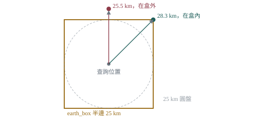
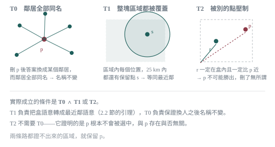
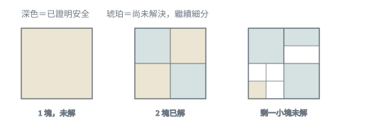
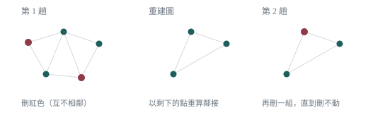

# Point Pruning

> This document describes the **prune** stage of the release pipeline: how it removes
> a third of all place points without changing any query result. It is a cross-region
> step that runs after translate and before pack. It is **not restricted by country** —
> eligibility is decided entirely by the data, not by a country list.

## 1. The Problem

The `cities500.txt` that Immich imports grows every year. After this project switched
to official boundary data to rebuild place names, point density became far higher than
GeoNames' original data — Japan has 125,130 points and Indonesia 108,673, together
almost half of the 487,372 points worldwide.

A larger file hurts in three places, and **download size is not the important one**:

| Dimension | Why it matters |
| :--- | :--- |
| Uncompressed `cities500.txt` | The file Immich actually reads and imports |
| `geodata_places` table and indexes | Database footprint, and how many rows each query scans |
| Reverse geocoding latency | Every photo with GPS triggers one lookup |
| `release.tar.gz` | Download only, and the deleted rows are the most repetitive ones — gzip already compressed them away |

The problem is worst in dense regions: a single lookup in Japan scans an average of
242 rows within 25 km to decide one place name. Many of those rows are **different
representative points of the same administrative division** — they compete with each
other, but whichever wins, the returned name is identical.

**Pruning removes exactly this kind of point: after deletion, every GPS coordinate
still resolves to the same answer.**

## 2. Premise: How Immich Looks Up a Place

Every design decision rests on the query Immich actually issues
(`server/src/repositories/map.repository.ts`):

```sql
SELECT * FROM geodata_places
WHERE earth_box(ll_to_earth_public($1, $2), 25000) @> ll_to_earth_public(latitude, longitude)
ORDER BY earth_distance(ll_to_earth_public($4, $5), ll_to_earth_public(latitude, longitude))
LIMIT 1
```

It returns `{country, state: admin1Name, city: name}`. When nothing is found, Immich
falls back to Natural Earth country boundaries, leaving `state` and `city` as `null`.

### 2.1 `earth_box` Is a Cube, Not a Disc

This is the most easily misread — and most consequential — detail of the whole design.

`earth_box(p, 25000)` produces an **axis-aligned cube in geocentric Cartesian
coordinates**, with half-side `h = 24,999.98 m`. It is not a 25 km spherical disc.
And the `WHERE` clause is **not followed by any `earth_distance` filter** — the box
decides who qualifies, and `ORDER BY` only ranks the qualifiers.

The consequence: **a nearer point can fall outside the box while a farther point falls
inside it.**



*A point offset tangentially by (20, 20) km is 28,284 m away — beyond 25 km — yet still
inside the box; a point 25.5 km due north falls outside. Verified directly in PostgreSQL.*

So "the nearest neighbour after deleting p is still the same administrative division"
**does not imply** "the SQL answer is unchanged". Any argument based on pure nearest
neighbour must account for the shape of the box separately.

### 2.2 The 25 km Lemma

The relationship between box and disc is not hopeless. One direction does hold:

> **If a point is within 25 km great-circle distance of the query location, it is
> necessarily inside the box.**

Proof: great-circle distance ≤ 25 km ⟹ chord length ≤ 25 km ⟹ each of the three
geocentric coordinate deltas is ≤ `h` ⟹ the point lies inside the box. (Verified with
one million random spherical samples, zero exceptions.)

The corollary is what makes everything else work: **as long as the query location's
nearest kept point is within 25 km, the box is guaranteed to contain the globally
nearest point, and the SQL is equivalent to pure nearest neighbour.** This converts
"box semantics" into "nearest-neighbour semantics", which is tractable geometrically.

## 3. Method: Keep It Unless You Can Prove Otherwise

For each candidate point `p`, the pruner attempts to prove one proposition:

> After deleting `p`, **every query location that could possibly be affected** still
> gets the same administrative division name from the SQL.

If the proof fails, the point is kept. The direction of this bias is deliberate —
**failing to delete only costs file size; deleting wrongly shows users the wrong name.**

### 3.1 The Affected Region

"Possibly affected" is not `p`'s Voronoi cell but:

```
Rp = { q : p falls inside earth_box(q, 25 km) }
```

that is, every query location that could admit `p` as a candidate. Since the box's 3D
diagonal is `h·sqrt(3) ~= 43.3 km`, `Rp` is necessarily contained within 43.5 km of `p`.

A `q` outside `Rp` means `p` is not in `q`'s box at all, cannot be selected, and is
therefore unaffected by the deletion.

### 3.2 Three Criteria

The proof has three tiers, cheapest first. They are not alternatives — **T0 is never
used on its own**.



*The division of labour between the three criteria. T1 and T2 are evaluated per region,
so different parts of the same candidate's neighbourhood may resolve by different routes.*

### 3.3 Checking an Entire Region

`Rp` is a continuous region containing infinitely many query locations, so exhaustive
checking is impossible. The approach is **recursive subdivision**:

1. Treat the whole region as one cell and ask, using **conservative interval estimates**,
   "is all of this safe?"
2. If the answer is yes, done; if not, split into four and ask again for each
3. Smaller cells mean tighter intervals, which makes the question easier to answer

The key word is *conservative*: every interval is **widened outward**, so the prover may
fail to answer but never answers wrongly. This is the opposite of "treat anything under
a few metres as safe" — outward widening makes proofs **harder**, not easier.



*Recursive subdivision. Each candidate has a fixed cell budget; if unresolved area remains
when the budget runs out, the candidate is kept.*

**Subdivision uses a gnomonic projection, not a latitude-longitude grid.** The gnomonic
projection maps great circles to straight lines, so a straight-edged rectangle in the
plane back-projects to a **geodesically convex** quadrilateral on the sphere — every
point inside is a normalised convex combination of the four corners, which is what makes
"bound the whole cell from its four corners" valid. Latitude-longitude rectangles do not
have this property.

Each cell's bound is the intersection of two estimates: a **spherical cap bound**
(treating the cell as a circumscribed cap — still valid for large cells but very loose)
and a **corner bound** (exploiting the linearity of the convex combination, nearly exact
for small cells). Using the cap bound alone causes the cell count to explode.

### 3.4 The Subdivision Budget

The budget is "how many cells a single candidate may be split into". Raising it proves
more points but costs time. Measured on the full dataset, each budget run to convergence:

| Budget | Deleted | Share | Time | Seconds per extra 1,000 points |
| ---: | ---: | ---: | ---: | ---: |
| 256 | 144,264 | 29.60% | 39 s | — |
| 512 | 153,619 | 31.52% | 43 s | 0.4 |
| 1024 | 159,031 | 32.63% | 49 s | 1.1 |
| **2048** | **163,076** | **33.46%** | **61 s** | **3.0** |
| 4096 | 165,411 | 33.94% | 79 s | 7.7 |

There is no clear knee — it is a smooth diminishing return: each doubling roughly halves
the additional deletions. **2048** is used.

After parallelisation the whole curve is cheap — even 4096 costs only 18 seconds more.
The reason to pick 2048 over 4096 is not time but the **marginal return itself**: 4096
deletes 1.4% more points, and the resulting size difference is not measurable.

## 4. Why Multiple Passes

T0's argument requires `p`'s neighbours to **survive**. If `p` and its neighbours are
deleted together, the argument breaks.

A single pass can therefore only delete an **independent set** — a set of mutually
non-adjacent points. For a planar triangulation that is roughly 25% of all points, so
one pass is nowhere near enough.



*Every pass recomputes spherical Delaunay adjacency on the surviving point set, re-proves
each candidate, and selects a new independent set.*

Convergence took **20 passes** in practice:

| Pass | Candidates | Proved | Deleted | Cumulative |
| ---: | ---: | ---: | ---: | ---: |
| 1 | 252,423 | 164,382 | 36,774 | 36,774 |
| 2 | 127,608 | 127,602 | 27,636 | 64,410 |
| ... | | | | |
| 19 | 1,972 | 1,963 | 502 | 162,716 |
| 20 | 1,461 | 1,446 | 360 | 163,076 |

From pass 2 onwards, only candidates that were *proved but skipped by the independent-set
rule* are re-proved. Deleting points only shrinks the kept set, making coverage and
witnesses harder to establish, so a candidate that failed last pass is very unlikely to
succeed now — skipping them is the conservative choice.

## 5. Verification

**The proof itself is the source of correctness.** But a proof is code written by humans
and may contain bugs, so measurement serves as a net for catching them.

### 5.1 Differential Testing

Two PostgreSQL databases are built (original data and pruned data). Immich's exact query
runs against every probe point on each, and the returned
`(countryCode, admin1Name, name)` triples are compared.

This ran in two rounds that together cover all 163,076 deletions.

**Round 1: 4.55 million adversarial probes**, covering the 158,322 deletions in Japan and
Indonesia. The probes are aimed deliberately at the places most likely to break:

| Category | Count | Why here |
| :--- | ---: | :--- |
| Deleted points themselves | 158,322 | The direct target of deletion |
| Midpoints to Delaunay neighbours | 116,918 | Boundaries between two points' territories |
| Box faces, +/- 0.01 / 1 / 50 m | 2,880,000 | **Aimed squarely at the box-vs-disc issue in 2.1** |
| Global random | 1,000,000 | Unbiased sample |
| Land sampling | 400,000 | Reference sample independent of the point set |

```
1,067,876 probes had their original winner deleted (genuinely re-adjudicated)
Zero label changes, zero newly empty results
```

**Round 2: 1.79 million probes**, covering the 4,754 additional deletions in Taiwan,
South Korea, Thailand and Malaysia.

Splitting it this way is sound because the later deletion set is a strict **superset**:
the 158,322 decisions for Japan and Indonesia are unchanged (verified item by item), so
round 1's conclusion still holds and only the increment needs checking.

Round 2 uses a strict shortcut: a coordinate's answer can only change if its original
winner happened to be deleted, so the winner is resolved once against the original data
and only probes whose winner falls in the new deletion set are recomputed. The probe area
is the four countries' bounding boxes widened by 0.5 degrees — more than the 43.5 km box
diagonal, so probes outside it cannot be affected by construction — on a 0.01 degree grid
(about 1.1 km).

```
1,794,336 probes, of which 42,306 had their original winner deleted (re-adjudicated)
Zero label changes, zero newly empty results
```

### 5.2 The Diff Is Not the Source of Correctness

One class of error the diff cannot catch, stated plainly:

If a coverage check had a bug and wrongly deleted a point, the consequence would be that
some location's nearest kept point exceeds 25 km. But the box diagonal is 43 km, and in
dense regions the box **usually still contains another point with the same name** — so
the returned name is unchanged and the result is not empty. **The diff reports all zeros
while the proof is in fact wrong.**

The diff is a net, not a proof. Correctness comes from the criteria in 3.2 and their
derivation, backed by unit tests that pin known counterexample configurations in place.

## 6. Results

Measured with budget 2048, run to convergence, on PostgreSQL 17:

| Metric | Before | After | Change |
| :--- | ---: | ---: | ---: |
| Rows | 487,372 | 324,296 | **-33.5%** |
| `cities500.txt` (uncompressed) | 63.9 MB | 47.8 MB | **-25.2%** |
| `geodata_places` table + indexes | 221 MB | 164 MB | **-25.8%** |
| GiST spatial index | 76 MB | 41 MB | **-46.1%** |
| Reverse lookup avg (dense regions) | 3.362 ms | 1.145 ms | **-66%** |
| Reverse lookup p50 (dense regions) | 2.004 ms | 0.626 ms | **-69%** |
| Reverse lookup p95 (dense regions) | 12.207 ms | 4.098 ms | **-66%** |
| `release.tar.gz` | 21.7 MB | 19.6 MB | -9.7% |

Latency is measured with one lookup each at 20,000 random places in Japan, Indonesia,
Taiwan, South Korea and Thailand. `release.tar.gz` shrinks the least because compression
already absorbed most of the redundancy — **the compressed archive is not the headline
metric here; the uncompressed size and the database footprint are.**

**Not a single distinct administrative division name disappeared.** Pruning only removes
redundant representative points within the same division; no place name is lost.

### 6.1 Sparse Regions Are Unaffected

Vast, thinly populated regions such as Canada and Russia already have large areas with no
point within 25 km (88.1% of Canada's land, 76.3% of Russia's). Immich already falls back
to Natural Earth for those locations and shows the country name only.

Pruning **does not make this worse**, for two reasons:

1. Sparsity means neighbours belong to different administrative divisions, so T0 fails.
   Measured globally, all 203,460 T0 candidates fall in Japan, Indonesia, Taiwan,
   Thailand, South Korea and Malaysia.
2. Even for points that do enter the candidate pool, T1 requires that the whole region
   remains covered within 25 km after deletion; in sparse regions that cannot be proved,
   so the point is kept. Measured: **59 countries produce candidates, but only 6 prove
   any point at all** — the United States has 12 candidates, China 70, Brazil 116,
   Russia 24, Iceland 2, and **all of them delete nothing**. What stops them is the
   prover itself, not a country list.

In other words, **"nothing within 25 km after deletion" is structurally impossible.**

Improving positioning accuracy in sparse regions requires adding data, which is separate
work unrelated to pruning.

## 7. Running It

Pruning is a stage of the release pipeline and is enabled by default:

```bash
cargo run --release -- release --locationiq-api-key "<api_key>" --country-code MY
```

To run it alone, or skip it:

```bash
cargo run --release -- prune --output-folder ./output   # prune only
cargo run --release -- release --pass-prune ...         # skip pruning
```

A full run takes about 7 minutes single-threaded.
